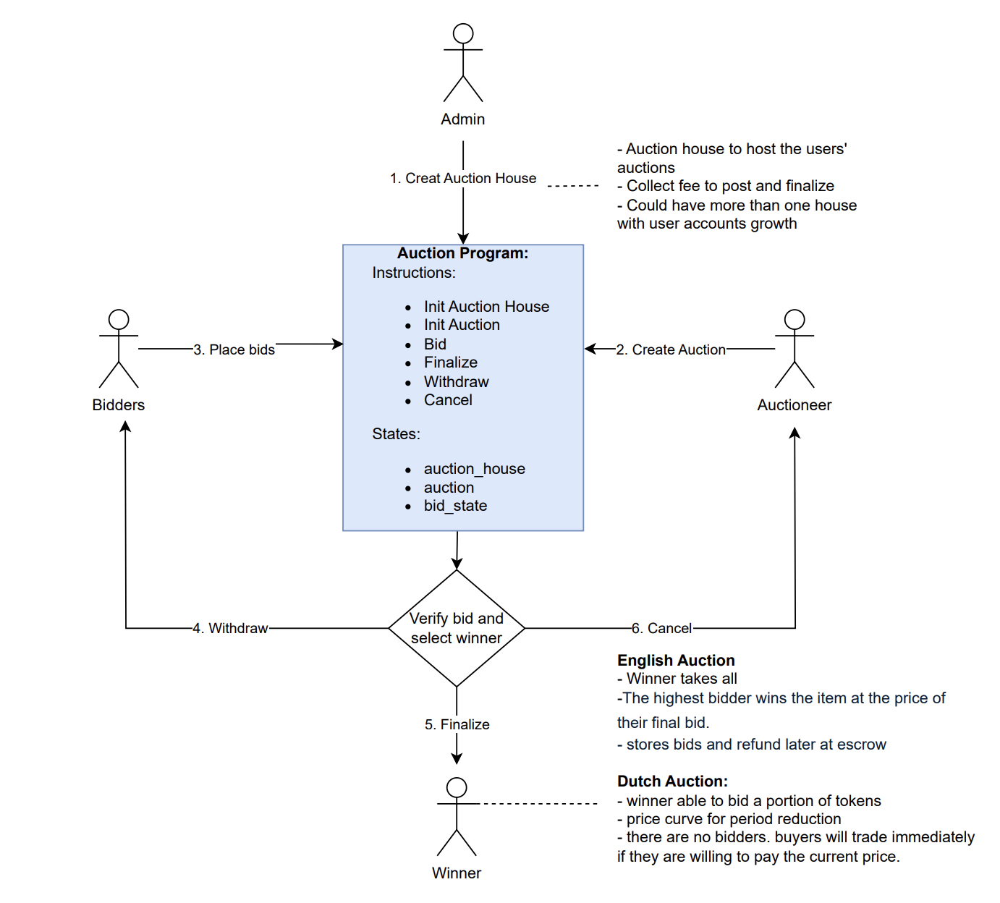

# Capstone project - Auction
## Overview
A blockchain-based auction that leverages smart contracts for price discovery and efficient resource allocation.
## Use case
+ Dutch Auctions for Fair and Transparent Token Launches
+ Optimized English Auctions for Rare Digital Collectibles
## Program Architecture

## Features
```
init_house
init_auction
bid
finalize
withdraw
cancel
```
## Command line usage
CLI for interacting with the Solana Aucton program
```
cargo run -- --help
cargo run -- init-house 100
cargo run -- -k ../demo/auctioneer.json init-auction GRXHSrCmGPAsEDTFtrKH78xjHznWaFXBzdvdV35L
GTTZ 7GhJv6M85G59zHSvZBjZtaVEWExC5JLeFQASC2NNUgym 4.567 5000 100
```


